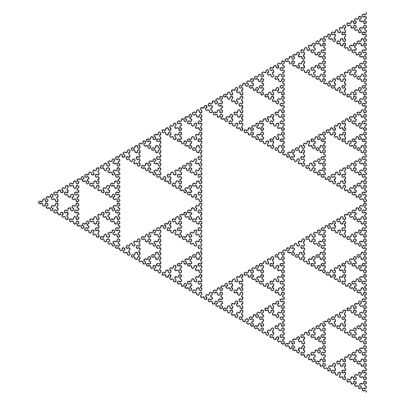
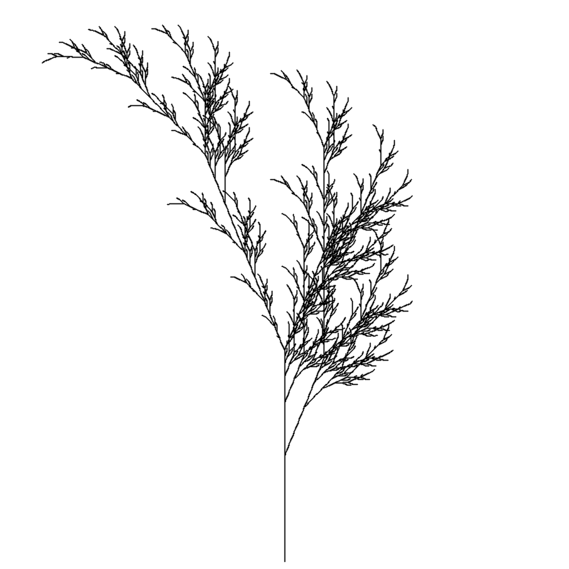
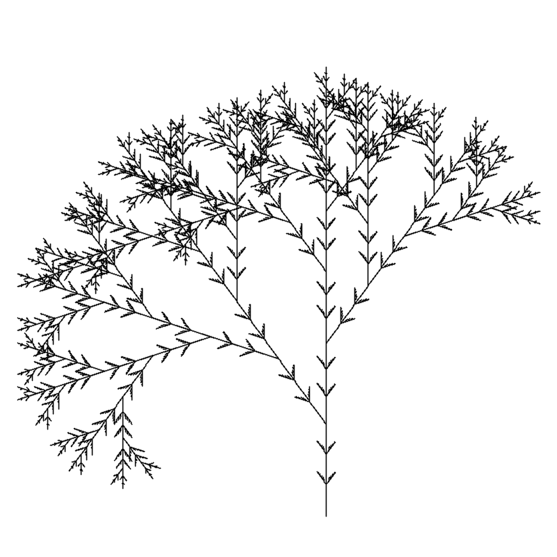
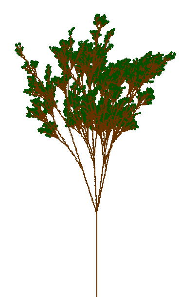
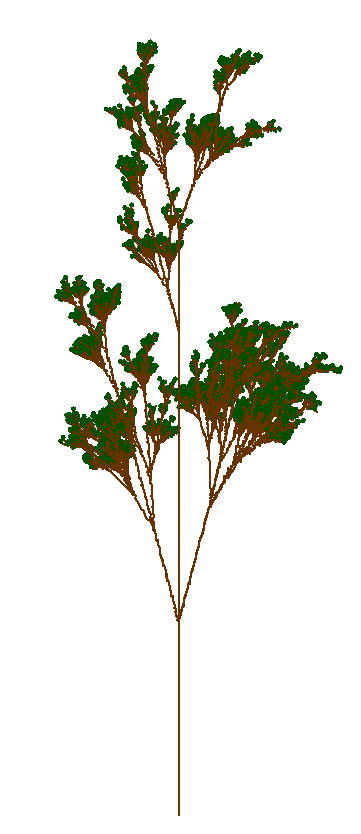
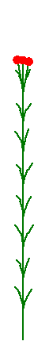

<!-- <include src="../header.html"></include> -->

**Foreword:**
In this short report, I will make a quick review of L-systems, relying on the
book The algorithmic beauty of plants [@TheAB], without talking about the code
implementation. The theoretical tools have not changed since the release of the
book, it fully covers the state-of-the-art. I will simply explain part of its
content. Finally, I have carefully chosen to explain only the parts that are the
most interesting to me.

# L-Systems {#l-systems .unnumbered}

This section presents the simplest class of L-systems, those which are
deterministic and context-free, called D0L-systems. One could define
L-systems as a formal way of defining developmental processes, that
suits well to organic models, and especially plant-development models.
More formally, an L-system $G$ is defined as a tuple
$\langle V, \omega, P \rangle$, where $V$ is the alphabet of symbols,
$\omega \in V^+$ is the axiom, and $P \subset V \times V^\*$ is the set
of production rules, also called rewriting rules: it takes a character
$c \in V$ and returns a string $s \in V^\*$. The axiom is the starting
character of the L-system, that will fully determine the iteration
process. Let $s_i$ be the result of the $i^{th}$ iteration, we define
$s_0 = \omega$. An iteration consists of the transformation
$s_i \rightarrow s_{i+1}$ defined by the successive transformations of
the characters of $s_i$ according to the production set $P$.\
For the sake of simplicity, if $x$ and $y$ are two string in $V^\*$, then
$xy$ is the concatenation of $x$ and $y$.

#### Example {#example .unnumbered}

Let $G_1 = \langle V, \omega, P \rangle$, where
$V = \{A,B\}; \omega = A; P =
\{A\rightarrow AB, B\rightarrow BA\}$. Then the iterations go as
follows:

$$\begin{aligned}
        s_0 &= \omega = A \\\\\\
        s_1 &= P(A) = AB \\\\\\
        s_2 &= P(A)P(B) \\\\\\
            &= ABBA \\\\\\
        s_3 &= P(A)P(B)P(B)P(A) \\\\\\
            &= ABBABAAB
\end{aligned}$$

It almost fully describes an L-system, we now need to interpret the
result of an iteration.

# Turtle {#turtle .unnumbered}

Turtle graphics, firstly defined by the Logo programming language
[@Logo] is a descriptive way of defining computer drawings. We can hence
consider an interpretation of some characters (not necessarily all of
them) of the alphabet. This will make the turtle move on the screen, and
hence draw. For example, $F$ moves forward a step $l$, $+$ turns
clockwise the turtle of an angle $\delta$, and $-$ turns
counterclockwise the turtle of an angle $\delta$.

#### Example

If we let $l=1, \delta = 90$, and consider the sentence
$$FFF+FF+F+F-F-FF+FFF \ ,$$ then the turtle graphics formalism yields the
following, starting in $(0,0)$:

By combining the L-System formalism and the turtle graphics, one can
easily generate fractal like patterns, thanks to the recursive structure
of L-systems.

A triangle

The above figures shows a fractal-like model where each pattern
repeats itself, this comes from the recursive manner of defining an
iteration.

# More realistic L-systems {#more-realistic-l-systems .unnumbered}

This definition of L-systems yields interesting and fractal-like
results, but we need to add a branching possibility in order to obtain
plant-like results. This is achieved by considering a stack of turtle
*states* and its associated operations: $\texttt{Push}$ and
$\texttt{Pop}$. Those two operations are usually represented by the
characters $[$ and $]$ respectively. This enhancement yield results
shown in fuzzy and
aglae.

A fuzzy tree

The plant-like pattern appears directly, however, we will explore some
enhancement techniques in order to make those more realistic. The issue
that one faces with this kind of *very simple* L-system, is that the
plant generated by a L-system is unique, and the artificial regularity
is striking. To solve this problem, it is possible to randomize the
turtle parameters, the L-system or both.

Randomizing only the turtle parameters has the effect of letting the
underlying structure of the results unchanged, while randomizing the
L-system itself probabilistically changes the structure, which has the
effect of making the result more realistic. Combining the two options is
in the end the preferable solution. Such a result is shown in ol_iterations.

    
    
An aglae

The list of species being described by L-systems grammar is vastly
increasing. Models have been made: cucumber growth [@cucumber],
sunflower [@TheAB], barley [@barley], sorghum [@sorghum].

    

        

            
        

        

            
        

        

            
        

    

    
 Three iterations of an OL-System (a random tree) 

# Developmental models of herbaceous plants {#developmental-models-of-herbaceous-plants .unnumbered}

In the case of self-similar structures, like trees illustrated in fuzzy, aglae and ol_iterations the synthesis methods based on rewriting
rules, are fairly expressive and randomizing strategies fix the problem of
unnatural regularity. However, a more general approach is needed to model the
large variety of developmental patterns and structures found in nature,
especially, it is not possible to obtain the famous sunflower only with
0L-systems. When one observes nature, one sees that the flower development is,
although repetitive, highly controlled. For instance, in most of the cases when
a flower grows, the stem grows first, and in the end the flower appears. Partial
L-systems offer this possibility, especially for the case of single-flower
shoot.

### Partial L-systems {#partial-l-systems .unnumbered}

Partial L-systems can express the vegetative growth of a plant and,
after a certain time, the production of the flower. It's not in essence
a new kind of L-systems, in the sense that it is completely defined by a
stochastic L-system, but arises from the interpretation of these.
Considering the example given in [@TheAB] : $$\label{eq:partial}
    \begin{aligned}
        \omega & : a \\\\\\
        a \rightarrow &
        \begin{cases}
            I [L] a & \text{w.p. } \alpha\\\\\\
            I [L] A & \text{w.p. } \beta
        \end{cases} \\\\\\
        A \rightarrow & K
    \end{aligned}$$

We of course have to have $\alpha + \beta = 1$,
$\alpha, \beta \geq 0$. The flower stays in its vegetative phase as long
as the rule $a\rightarrow I[L]a$ is applied, and once the rule
$a\rightarrow I[L]A$ is selected, the shot stops and the flower appears.
It is hence possible to control the average height of the flower, by
controlling the ratio $\frac{\alpha}{\beta}$, that can be interpreted as
the average height of the result as shown in partial_iteration.
Note that the number of iterations is an
upper-bound, since the rule $a\rightarrow
I[L]A$ is blocking.

    

        

            
        

        

            
        

        

            
        

    

  
Three iterations of a partial LSystems 

### Context-sensitive L-systems {#context-sensitive-l-systems .unnumbered}

Unlike the 0L-systems in which production rules are applied regardless
of the context, context-sensitive L-systems, apply rules depending on
the context of the character evaluated, that is, its predecessors and
successors. This effect is useful in simulating interactions between
plant parts. We thus introduce production rules of the form
$a_l < a > a_r \rightarrow \chi$, where the rule $a
\rightarrow \chi$ is applied if and only if $a$ is preceded by $a_l$ and
followed by $a_r$. This allows to *move* characters (see example), and
then introduce a sort of timer in the process. Systems in which we
consider only one side for the context are denoted 1L-systems, and the
one where we consider the two neighbors of a character, as the following
example, are called 2L-systems.

#### Example (from [@TheAB], shortened):

$$\begin{aligned}
        \omega & : baaa \\\\\\
        b\<a & \rightarrow b\\\\\\
        a\<b\> \emptyset & \rightarrow f\\\\\\
        b & \rightarrow a \\\\\\
\end{aligned}$$

The first generated sentences are given below:

$$
baaa \Rightarrow % \quad;\quad
abaa \Rightarrow % \quad;\quad
aaba \Rightarrow % \quad;\quad
aaab \Rightarrow % \quad;\quad
aaaf \quad
$$

#### Note:

The priority of the rule application not is given by their order of
definition, but by the range of their context the broadest context is
given priority.

After the $4^{th}$ iteration, the character $f$ appears at the end of
the sentence, meaning that if we associate $f$ to the flower and $a$ to
the stem, then the flower appears after four iterations at the top of
the stem. It is easy, starting from this example, to infer how one can
use context-sensitive L-systems to create flower-like models.

# Open problems - Miscellaneous {#open-problems---miscellaneous .unnumbered}

An interesting application of parametric context-sensitive L-systems has
been exposed by Hammel and Prusinkiewicz [@diff-eq], is the use of those
systems to express numerical solutions to initial value problems for
partial differential equation.\
Every 0L-system $G$ defines an obvious set of derivations $E(G)$. Those
objects, the *0L sequence languages* have been studied in
[@ROZENBERG1980195].\
**Open problem:** Given two arbitrary OL-systems $G_1$ and $G_2$, is it
possible to decide whether $E(G_1) = E(G_2)$?\
R. Book conjectured that the answer to the above question is positive.\
A locally contenative sequence is a sequence of words in which each word
can be constructed as the concatenation of previous words in the
sequence.\
**Open problem:** Is it decidable whether an arbitrary DOL-system is
locally contenative ?

The above problem constitutes today perhaps the most important open
problem concerning DOL systems.

# L-systems definitions {#app:ldef}

## Triangle {#app:tri}

Parameters: $$\begin{aligned}
        l & =10 \\\\\\
        \delta & = 60 \\\\\\
    \end{aligned}$$ System: $$\begin{aligned}
        \omega & : A \\\\\\
        \\\\\\
        B & \rightarrow -A+B+A- \\\\\\
        A & \rightarrow +B-A-B+ \\\\\\
    \end{aligned}$$

## Fuzzy tree {#app:fuzzy}

Parameters:

$$\begin{aligned}
        l & =10 \\\\\\
        \delta & = 22 \\\\\\
    \end{aligned}$$

System:
$$\begin{aligned}
        \omega & : X \\\\\\
        \\\\\\
        F & \rightarrow FF \\\\\\
        X & \rightarrow F-[[X]+X]+F[+FX]-X \\\\\\
\end{aligned}$$

## Randomized tree {#app:fuzzy}

Parameters: $$\begin{aligned}
        l & =10 \\\\\\
        \delta & = 15 \\\\\\
    \end{aligned}$$ System: $$\begin{aligned}
        \omega & : X \\\\\\
        \\\\\\
        F & \rightarrow FF \\\\\\
        X & \rightarrow \begin{cases}
            F-[[XC]+XC]+[[XC]+XC]-X & \text{w.p.} \frac{1}{4} \\\\\\
            F-[[XC]+XC]+[-FXC]+X & \text{w.p.} \frac{1}{4} \\\\\\
            F[+XC][-XC]FX & \text{w.p.} \frac{1}{4} \\\\\\
            F[+XC]F[-XC]+X & \text{w.p.} \frac{1}{4} \\\\\\
        \end{cases}
    \end{aligned}$$

